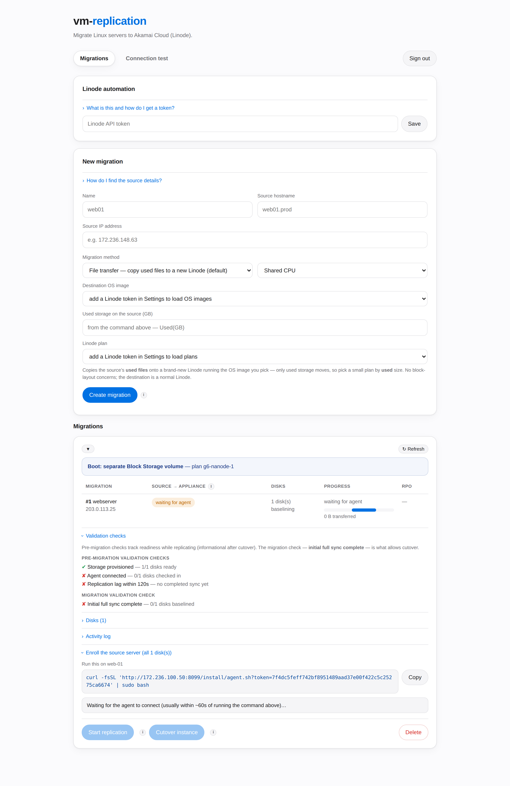

# vm-replication — migrate Linux servers to Akamai Cloud from a web console

**vm-replication** migrates Linux servers from anywhere — on-prem, AWS, GCP,
Azure, other clouds — **to Akamai Cloud (Linode)**, driven entirely from a
**web console** that you host yourself.

You stand up one small Linode (the **replication server**), open its console in
a browser, and migrate any number of source servers from there: register a
source, run one generated command on it, watch replication, then cut over with
guided, validated steps. Data flows over **mutually-authenticated TLS**, and the
console never needs inbound access to your sources.



## Three migration methods, one console

| Method | What moves | Best for |
|---|---|---|
| **File transfer** *(default)* | Only the **used files** — a mostly-empty 80 GB disk copies its ~4 GB — onto a brand-new Linode running an OS image you pick | Most servers: cheapest, usually fastest, no partition/bootloader concerns |
| **Volume boot** | Every disk, **block for block**, onto Block Storage volumes cloned into launchable image volumes | Exact disk-level replicas, multi-disk servers, keeping volumes as artifacts |
| **Disk boot** | Every disk, block for block, onto the new Linode's own **local NVMe disk** | Disk-level replica without a separate volume |

## Quick start

1. **Create a Linode** for the replication server (a 2 GB shared plan is
   enough; Ubuntu/Debian recommended) and SSH in as root.
2. **Install everything with one command** — it bootstraps its own
   dependencies, builds the binaries, generates certificates and an admin
   password, and installs the `applianced` service:

   ```bash
   git clone https://github.com/Tiny125/vm-replication.git
   cd vm-replication
   sudo scripts/install-replication-server.sh
   ```

3. **Open the console** at `https://<replication-server-ip>:8080` and sign in
   with the printed password (the browser warns about the self-signed
   certificate — verify the printed SHA-256 fingerprint, then proceed).
4. **Migrate**: add your Linode API token, create a migration, run the
   generated one-liner on the source, click **Start replication**, and cut over
   when the copy is complete.

**The full step-by-step guide — with screenshots of every step — is served by
your own replication server at `https://<replication-server-ip>:8080/documentation`.**
The same content in Markdown: [`CONSOLE.md`](CONSOLE.md).

## Why it's safe

- **Verified transfer** — every block/file is SHA-256 checked on arrival; the
  receiver syncs to disk before acknowledging; delta passes apply atomically
  (an interrupted pass is discarded whole, never half-applied).
- **Validated cutover** — for the block methods the boot image is converted and
  **validated as bootable before you're asked to power off the source**; a
  problem surfaces while the source still runs, so you lose no uptime.
- **Gated, guided flow** — replication starts only when you click Start; the
  cutover is a guided three-step flow that tells you exactly when it is safe to
  power the source off.
- **Encrypted everywhere** — the console is HTTPS, the data plane is mutual
  TLS, and your Linode API token is stored encrypted at rest.

---

## Advanced

### Try it locally in 30 seconds (no Linode account)

Replicates between two file images on one host — full sync, delta sync, and a
byte-identical verification:

```bash
make smoke
```

### Build from source

```bash
make build      # static binaries in bin/ (CGO-free, portable)
make test       # unit tests
make vet        # go vet
```

### Manual / CLI workflow

Prefer to drive the agent and receiver by hand (no console)? See
[`docs/GETTING_STARTED.md`](docs/GETTING_STARTED.md) and the cutover runbook in
[`docs/CUTOVER.md`](docs/CUTOVER.md). A fleet control plane (`controld` +
`replctl`, with a dashboard and Prometheus metrics) is documented in
[`docs/OPERATIONS.md`](docs/OPERATIONS.md).

### Documentation map

| Document | What it covers |
|---|---|
| **`https://<your-server>:8080/documentation`** | the full console guide with screenshots (served by the appliance) |
| [`CONSOLE.md`](CONSOLE.md) | the same console guide in Markdown, plus sizing and deep detail |
| [`docs/FILE-MIGRATION.md`](docs/FILE-MIGRATION.md) | the file-transfer method's architecture |
| [`docs/COMPATIBILITY.md`](docs/COMPATIBILITY.md) | supported sources, prerequisites, limits |
| [`docs/CLOUD-COMPAT.md`](docs/CLOUD-COMPAT.md) | per-cloud notes (AWS, GCP, Azure, …) |
| [`docs/GETTING_STARTED.md`](docs/GETTING_STARTED.md) | manual/CLI workflow |
| [`docs/CUTOVER.md`](docs/CUTOVER.md) | cutover runbook (CLI) |
| [`docs/OPERATIONS.md`](docs/OPERATIONS.md) | running the fleet control plane |
| [`docs/TROUBLESHOOTING.md`](docs/TROUBLESHOOTING.md) | error reference |
| [`docs/DESIGN.md`](docs/DESIGN.md) | architecture and roadmap |

### Repository layout

| Path | What |
|---|---|
| `cmd/applianced` | the appliance: web console + documentation site + per-migration receivers + Linode finalize |
| `cmd/agent` | source-side agent: diff + stream changed blocks / copy files |
| `cmd/receiver` | target-side daemon: verify + write (block device or file tree) |
| `cmd/controld` · `cmd/replctl` | fleet control plane + CLI (advanced) |
| `internal/appliance` · `internal/linode` | console/server + Linode API client |
| `internal/protocol` · `internal/transport` | wire framing + mTLS |
| `internal/blockdiff` · `internal/cbt` · `internal/snapshot` | block diffing, change tracking, consistent reads |
| `internal/receiver` · `internal/store` | receiver logic + SQLite state |
| `scripts/` | installer, cert gen, smoke tests, Linode provisioning, machine conversion |

### Limitations & roadmap

Crash-consistent by default (block methods quiesce the source read-only at
cutover; use `--snapshot lvm` for app-consistency in the CLI workflow). The
`hashdiff` CBT backend rescans the disk each cycle (use `--cbt dmera` for
low-RPO). Roadmap: resume mid-stream, dedup + zstd/LZ4 transport, parallel
streams, automated reverse-sync rollback — see
[`docs/DESIGN.md`](docs/DESIGN.md#7-roadmap-toward-the-full-sketch).
